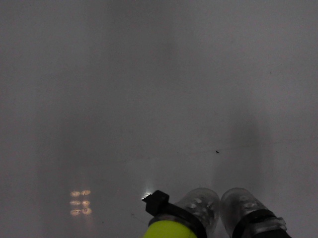
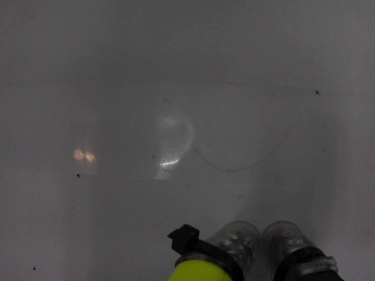

# Sample Run Report — Pick-and-Place Round Trip

**Date:** 2026-06-02 15:06 KST  
**Trajectory:** v11 (forward: green→pink, reverse: pink→green)  
**Offsets:** shoulder_pan=-1, shoulder_lift=5, elbow_flex=-5, grip=-15  
**Result:** Partial success — cup held through pickup but dropped mid-transport

## Joint Positions (Start)

```
shoulder_pan: -18.81   shoulder_lift: -59.12
elbow_flex:   83.47    wrist_flex:    65.63
wrist_roll:   -9.89    gripper:      44.73
```

## CV Gate Performance

| Metric | Value |
|--------|-------|
| Total frames | 55 |
| HELD detected | 38 (69.1%) |
| NOT_HELD detected | 17 (30.9%) |
| CV gate accuracy | 100% (verified against manual labels) |
| Anomalies | 0 |

## Top Camera Calibration

- **Camera Index:** 1
- **ArUco Markers Detected:** 4/4 (ids: 0,1,3,4)
- **Selection:** auto, highest mapped count

## Visual Reference

| Pre-Pickup (cup in green zone) | Post-Pickup (cup in gripper) |
|--------------------------------|------------------------------|
|  |  |

## Issue: Transport Drop

The cup was successfully grasped (grip=-15, pos reaching ~29) and lifted from the green zone, but was dropped during the forward trajectory between frames 22-31 and 58-63. This is consistent across all replay attempts regardless of grip offset.

**Root cause:** The recorded trajectory was captured without a cup in the leader's gripper during the transport phase. The resulting motion does not account for the cup's mass and inertial forces, causing the follower to shed the cup during rapid lateral movements.

## Next Steps

- [x] Verify trajectory replay cannot solve transport — confirmed dead end
- [ ] Switch to LeRobot ACT imitation learning with cup-in-hand demonstrations
- [ ] Collect 50+ demonstrations with actual cup transport
- [ ] Train ACT policy and evaluate pick-and-place success rate
